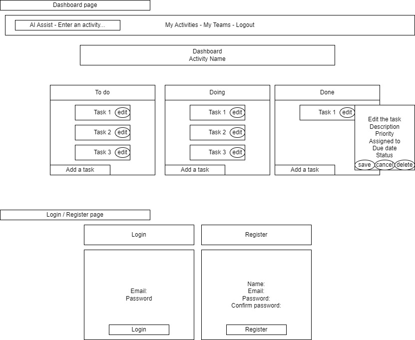

# SMARTLYDONE - Task Manager

SMARTLYDONE Task Manager is a RESTful API application that allows users to manage their tasks efficiently. It helps users keep track of their tasks, categorize them, and monitor their progress.
This project is deployed at Render.com and you can check it [here](https://smartlydone.onrender.com).

## Table of Contents

- [Features](#features)
- [Wireframes](#wireframes)
- [Entity Relationship Diagram](#entity-relationship-diagram)
- [Colors](#colors)
- [Technologies Used](#technologies-used)
- [Getting Started](#getting-started)
- [Prerequisites](#prerequisites)
- [Installation](#installation)
- [Meet the Team](#meet-the-team)

## Features

- User authentication
- Create, edit and delete activities and tasks
- Generate tasks using AI (OpenAI API)
- Set due dates and priorities for tasks
- Track task status (pending, in progress, completed)

## Wireframes

This is the foundational wireframe that kickstarted our application's design. We transform these basic elements into a sleek, user-friendly interface.


## User Stories

Our project's features are guided by user stories, encapsulating the needs and expectations of our valued users.


## Entity Relationship Diagram

Our project revolves around five interconnected tables, depicted in the diagram below. PostgreSQL serves as the foundation for our database.


## Colors

Discover the colors that define our project. Here's the list of colors and their respective codes:

| Color Name | Color Code | Color Preview                                              |
| ---------- | ---------- | ---------------------------------------------------------- |
| Blue 1     | #caf0f8    |     |
| Blue 2     | #90e0ef    |     |
| Blue 3     | #00b4d8    |     |
| Blue 4     | #0077b6    |     |
| Blue 5     | #023e8a    |     |
| Blue 6     | #03045e    |     |
| Grey 1     | #f8f9fa    |     |
| Grey 2     | #e9ecef    |     |
| Grey 3     | #dee2e6    |     |
| Grey 4     | #ced4da    |     |
| Grey 5     | #adb5bd    |     |
| Grey 6     | #6c757d    |     |
| Grey 7     | #495057    |     |
| Grey 8     | #343a40    |     |
| Grey 9     | #212529    |     |
| Green      | #b9fbc0    |      |
| Green 600  | #86dd8f    |  |
| Warning    | #e63946    |    |

## Technologies Used

This project makes use of the following technologies and tools:

- **Frontend:**

  - HTML5 and CSS3 for the user interface.
  - JavaScript for dynamic functionality.
  - Library/Framework - [Axios](https://axios-http.com/) for handling API requests.

- **Backend:**

  - [Node.js](https://nodejs.org/) with [Express.js](https://expressjs.com/)

- **Database**

  - [PostgreSQL](https://www.postgresql.org/)
  - pg - A PostgreSQL client for Node.js

- **Libraries**

  - bcrypt - hashing passwords securely.
  - dotenv - loading environment variables from a .env file.
  - openai - The OpenAI library for integrating with their services. -

- **Middleware**

  - connect-pg-simple - session storage using PostgreSQL.
  - cors - handling Cross-Origin Resource Sharing (CORS).
  - express-session - Middleware for managing sessions in Express.

- **Version Control:**

  - [GitHub](https://github.com) and Git for version control and collaboration.

- **Deployment:**
  - [Render](https://render.com) for deploying the application.
- **Development Tools:**

  - [Visual Studio Code](https://code.visualstudio.com) for the development environment.
  - [npm](https://www.npmjs.com) (Node Package Manager) for managing project dependencies.

- **API**
  - [OpenAI](https://openai.com) for AI-powered capabilities.

## Future Improvements and Refactoring

As we look ahead, here are some exciting enhancements and optimizations on our project's roadmap:

- Team Collaboration: We're gearing up to introduce team functionality, enabling users to create collaborative workspaces. This feature will empower teams to work seamlessly together on shared projects.
- Task Assignment: Enhancing productivity, we plan to implement task assignment capabilities within teams. Users can allocate tasks to specific team members, streamlining project management.
- Login as a Guest Mode: For a more user-friendly experience, we'll be introducing a "Guest Mode" that allows users to explore our application without the need for full account registration.
- Front-end Revamp with React: We aim to refactor our front-end using React for a more responsive and dynamic user interface.
- AI Error Handling: We're committed to improving the user experience by implementing more efficient error handling for our AI components. This ensures smoother interactions and robust AI integration.
- Responsive in Mobile: We're dedicated to ensuring that our application is accessible and user-friendly on mobile devices. Expect a responsive design that adapts seamlessly to mobile screen sizes.

## Getting Started

### Prerequisites

Before you begin, ensure you have met the following requirements:

- Node.js and npm installed on your local machine.
- PostgreSQL or another relational database management system set up.
- Git for version control.

### Installation

1. Clone this repository:

   ```bash
   git clone https://github.com/your-username/task-manager.git
   ```

## Meet the Team

Meet the amazing individuals who contributed to this project:

### [Joao Murara](https://www.linkedin.com/in/joao-murara/)

- [](https://www.linkedin.com/in/joao-murara/)
- [](https://github.com/JPMurara/JPMurara)

### [Bruno Gomes](https://www.linkedin.com/in/brunogomes11/)

- [](https://www.linkedin.com/in/brunogomes11/)
- [](https://github.com/brunogomes11)

### [Mariyam Shaheedha Mohamed](https://www.linkedin.com/in/maryam-shahydha-mohamed-6582b6279/)

- [](https://www.linkedin.com/in/maryam-shahydha-mohamed-6582b6279/)
- [](https://github.com/MaryamShaheedha)

Feel free to connect with us on LinkedIn and explore our GitHub profiles to learn more about our contributions and expertise.
